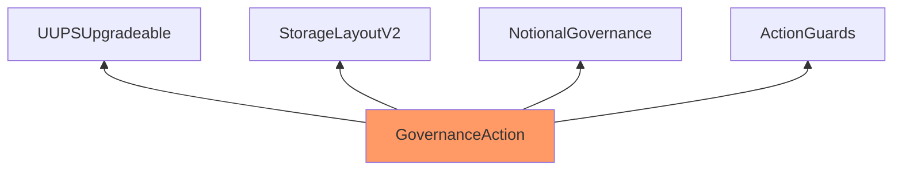
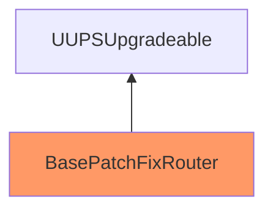
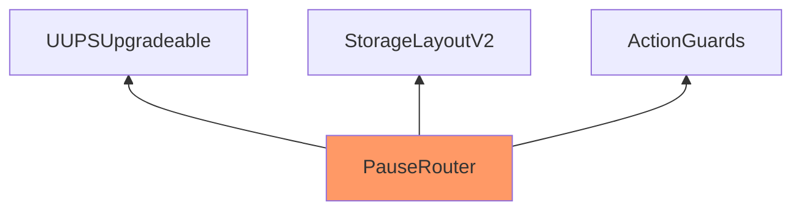

weeeh_

medium

# Corruptible Upgradability Pattern

## Summary
Storage of `GovernanceAction`, `BasePatchFixRouter` and `PauseRouter` might be corrupted during upgrading, thus causing wrong configuration of the governance settings.

## Vulnerability Detail
As described by openzeppelin, (https://docs.openzeppelin.com/contracts/4.x/upgradeable#storage_gaps), an empty reserved space in storage should be used in Upgradeable contracts as it allows us to freely add new state variables in the future without compromising the storage compatibility with existing deployments.

As PoC the following inheritance diagrams are given. Note: The contracts highlighted in Orange mean that there are no gap slots defined.

**GovernanceAction's Inheritance Diagram**



<br>

**BasePatchFixRouter's Inheritance Diagram**



<br>

**PauseRouter's Inheritance Diagram**



## Impact
Storage of `GovernanceAction`, `BasePatchFixRouter` and `PauseRouter` might be corrupted during upgrading, thus causing wrong configuration of the governance settings.

## Code Snippet

https://github.com/sherlock-audit/2023-03-notional/blob/main/contracts-v2/contracts/external/actions/GovernanceAction.sol#L42

https://github.com/sherlock-audit/2023-03-notional/blob/main/contracts-v2/contracts/external/patchfix/BasePatchFixRouter.sol#L12

https://github.com/sherlock-audit/2023-03-notional/blob/main/contracts-v2/contracts/external/PauseRouter.sol#L17

## Tool used
https://github.com/tin-z/smart_contract_auditor_tool

## Recommendation
Consider defining an appropriate storage gap in each upgradeable parent contract at the end of all the storage variable definitions as follows:

```solidity
uint256[50] __gap; // gap to reserve storage in the contract for future variable additions
```